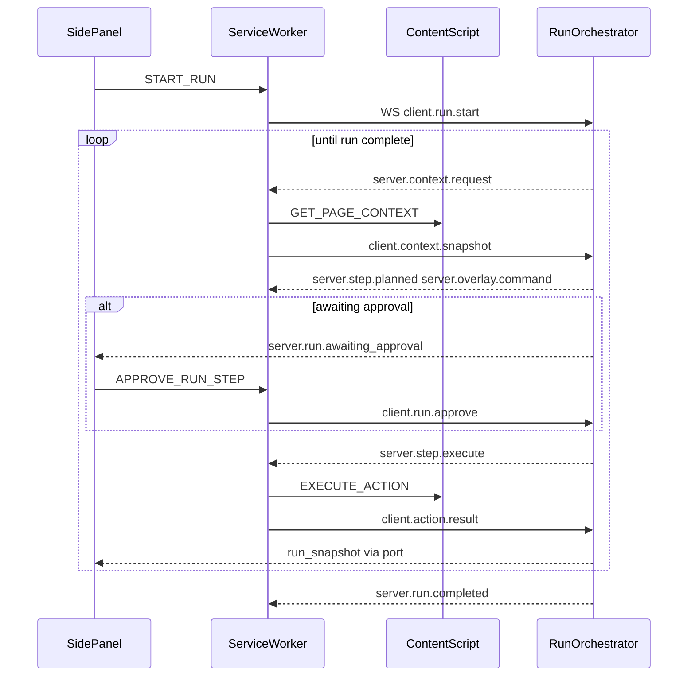

# Miru Chrome Extension Architecture

## Document Status

- Product: Miru
- Platform: Chrome Extension (Manifest V3) + Fastify backend (Groq + optional Supabase)
- Version: Draft 2 — implementation snapshot
- Date: May 16, 2026

> This revision tracks the actual code as of the autonomy + timeline UI work. Sections marked _(implemented)_ describe shipped behavior; sections marked _(aspirational)_ are design targets that are not yet wired up.

## 1. Goal

This document translates the product requirements into a buildable Manifest V3 extension architecture.

Miru should be implemented as a workflow-first browser automation system. The architecture should support:

- building a continuous stream of constrained browser commands
- exposing those commands through a readable chat transcript
- refining that workflow as page state changes
- replaying a successful workflow as a reusable extraction routine
- repairing a workflow when the target site drifts
- exporting a recorded session as executable JavaScript scaffolding

## 2. Current Repo Shape

The repo is now split into the Chrome extension and a standalone backend service.

**Chrome extension (`src/`)**

- `src/manifest.json` — MV3 manifest.
- `src/background/serviceWorker.ts` — session orchestration, planner client, action execution, auto-chain loop, scrape-artifact aggregation, recording, and export. Currently a single ~1.2k-line module (see §5 for the planned split).
- `src/content/contentScript.ts` — DOM inspection and command executor (`QUERY`, `CLICK`, `TYPE`, `SCROLL`, `WAIT`, `EXTRACT`, `EXTRACT_LIST`).
- `src/ui/sidepanel.html` — side panel shell.
- `src/ui/sidepanel.ts` — bootstrap that calls `initMiruApp`.
- `src/ui/app.ts` — timeline thread, state strip, composer, export toolbar.
- `src/ui/app.css` — design system (Fraunces + Spline Sans + IBM Plex Mono, warm-paper palette, timeline rail, motion).
- `src/ui/exportDownloads.ts` — CSV + PDF builders backed by `jspdf` and `jspdf-autotable`.
- `src/shared/types.ts` — wire types shared between SW, content script, and UI.
- `src/shared/constants.ts` — defaults (prompt, storage keys, message source tag).
- `src/generated/runtime-config.ts` — backend URL injected at build time by `scripts/generate-extension-config.mjs`.

**Backend (`backend/`)**

- `backend/src/app.ts` — Fastify factory; decorates `app.planner` and `app.storage`; Pino JSON logging.
- `backend/src/routes.ts` — `GET /health`, `POST /v1/plan`, `POST /v1/plan/stream` (SSE).
- `backend/src/planner.ts` — Groq client + JSON-schema constrained planner output + aligned narration streamer.
- `backend/src/storage.ts` — in-memory adapter with optional Supabase persistence (`miru_sessions`, `miru_plans` tables).
- `backend/src/config.ts`, `loadEnv.ts` — env loading.
- `backend/src/types.ts` — backend mirror of the planner-facing types.

**Build / packaging**

- `scripts/generate-extension-config.mjs` writes `src/generated/runtime-config.ts`.
- Root `npm run build` runs `tsc -p tsconfig.build.json`, then bundles the content script and the side panel via `esbuild` (`dist/content/contentScript.js`, `dist/ui/sidepanel.js`), then copies manifest, HTML, and CSS into `dist/`.
- The side panel must be bundled (not raw ES modules) because `jspdf` / `jspdf-autotable` use bare specifiers that the browser module loader cannot resolve.

## 3. Recommended V1 Architecture

### Extension Components

#### Side Panel UI _(implemented)_

Responsibilities:

- unified timeline thread that merges chat messages and workflow steps off a single 1px rail
- explicit state strip above the composer for `planning`, `executing`, `awaiting_input`, `awaiting_approval`, `capturing`
- composer behavior split: prompt send vs `RESPOND_TO_ASK` answer vs `APPROVE_PENDING_ACTION` button, with option chips when `pendingAsk.options` is present
- streaming planner narration (assistant pill that types out as SSE tokens arrive)
- export toolbar (CSV / PDF) when `scrapeArtifacts` is non-empty
- mode pill (Auto / Ask) — `interactive` is collapsed into `ask` in the UI

Notes:

- primary Miru shell for task sessions
- remains visible while the page changes
- avoids dashboard chrome; behaves like a conversational operator console
- recording / routine save UI is not yet implemented (the SW already records steps; the affordance is missing)

#### Background Service Worker _(implemented)_

Responsibilities:

- session lifecycle (`startSession`, `STOP_SESSION`, `RESPOND_TO_ASK`, `APPROVE_PENDING_ACTION`, `PLAN_NEXT_ACTION`, `TOGGLE_RECORDING`, `EXPORT_SESSION_SCRIPT`, `REFRESH_CONTEXT`, `GET_SESSION`)
- page-context capture (screenshot via `chrome.tabs.captureVisibleTab`, DOM snapshot via content script)
- planner client over SSE (`/v1/plan/stream`): subscribes to `assistant_token` tokens, surfaces them to the UI through a long-lived port (`miru-session-stream`)
- action routing: `ASK_USER` → `awaiting_input` + `pendingAsk` (never sent to the page); everything else → `executePendingAction`
- auto-chain loop (`runAutoModeContinuation`) — after a successful auto-mode step, re-enter plan → execute up to `AUTO_CHAIN_MAX_STEPS = 25` times, stopping on `STOP`, `awaiting_input`, `awaiting_approval`, error, or step cap
- scrape-artifact aggregation: successful `QUERY` / `EXTRACT` / `EXTRACT_LIST` becomes a `ScrapeArtifact` appended to `SessionState.scrapeArtifacts` (trimmed to 40 artifacts × 1500 rows)
- recording lifecycle + export script (`buildExportedScript` emits a runnable JS scaffold; `ASK_USER` is a no-op comment)
- storage: writes the full `SessionState` to `chrome.storage.session` on every mutation; reads on every handler entry

Constraints:

- no DOM access
- event-driven, non-persistent lifecycle — all state lives in `chrome.storage.session`, no in-memory globals beyond ephemeral message ports

#### Content Script _(implemented)_

Responsibilities:

- structured-action executor — handles `QUERY`, `CLICK`, `TYPE`, `SCROLL`, `WAIT`, `EXTRACT`, `EXTRACT_LIST`
- DOM snapshot for planner context (URL, title, visible-text length, link/form counts, trimmed HTML preview, interactive element summaries)
- element highlight (`miru-highlighted` class on the last targeted node)
- auto-mode page overlay (`SET_PAGE_OVERLAY`): banner, target bounding box, and cursor hint while the service worker plans and executes (`src/content/pageOverlay.ts`)

Constraints:

- never evaluates planner-supplied JavaScript
- operates only on the structured `MiruAction` payloads validated by the SW
- `ASK_USER` never reaches the content script

#### Remote Backend (`backend/`) _(implemented)_

Responsibilities:

- `POST /v1/plan` — synchronous planning (returns one `ProposedAction`)
- `POST /v1/plan/stream` — plan-first then SSE-stream an aligned narration that describes the already-chosen action, then emit the structured `plan_result` event
- structured-output planning via Groq with a JSON-schema-constrained response (one `MiruAction` per call, never a multi-step plan, never executable JS)
- optional Supabase persistence of sessions and plans
- Pino JSON logging at `LOG_LEVEL` (defaults to `info`)

Critical rules:

- the backend returns data, structured commands, rationale, and narration tokens only
- the backend must not return JavaScript for the extension to execute
- the planner emits exactly one next concrete action per call; multi-step plans are not supported by design (the SW's auto-chain loop is what makes goals progress)

Not yet implemented:

- authenticated user sessions (the backend has no auth layer; CORS is wide-open during local dev)
- routine-aware repair flows (no routine endpoints exist)
- task telemetry beyond Pino request logs

## 4. Data Flow

### WebSocket run loop _(implemented — default when `MIRU_USE_WS_RUNS=true`)_

The backend owns the multi-step run. The extension service worker is a **browser gateway** over `GET /v1/runs/ws` (see `src/shared/run-protocol.ts`). Protocol types are mirrored in `backend/src/shared/run-protocol.ts`.

1. User sends a prompt from the side panel → `START_SESSION` / `START_RUN` → [`runGateway.startRun`](src/background/runGateway.ts) opens (or reuses) a WebSocket and sends `client.run.start`.
2. Backend [`RunOrchestrator`](backend/src/run/orchestrator.ts) creates a run, emits `server.context.request`.
3. SW captures `PageContext` (+ screenshot, split frame if large) → `client.context.snapshot` / `client.context.screenshot`.
4. Backend calls `planNextAction`, streams narration (`server.chat.*`), emits `server.step.planned` + `server.overlay.command`.
5. Approval gates ([`run/gates.ts`](backend/src/run/gates.ts)): auto / ask / interactive — same rules as the legacy SW helpers.
6. Backend emits `server.step.execute` → SW runs `EXECUTE_ACTION` in the content script → `client.action.result`.
7. On success, backend emits `server.step.completed`, requests context again, repeats until `STOP`, cancel, error, or `RUN_MAX_STEPS` (50).
8. SW pushes live UI state via `run_snapshot` on the `miru-session-stream` port; storage listener also syncs `workflowSteps` / `scrapeArtifacts`.
9. User approve / ask answer → `APPROVE_RUN_STEP` / `ANSWER_RUN_ASK` → `client.run.approve` / `client.user.answer`. Stop → `CANCEL_RUN`.

While a run is active, [`tabs.onUpdated`](src/background/serviceWorker.ts) navigation refresh is deferred so the orchestrator does not race with `status === "capturing"`.



Set `MIRU_USE_WS_RUNS=false` in `.env` to fall back to the legacy per-step HTTP loop below.

### Legacy HTTP workflow loop _(still available when `MIRU_USE_WS_RUNS=false`)_

1. UI dispatches `START_SESSION` or `PLAN_NEXT_ACTION` / `RESPOND_TO_ASK`.
2. SW captures page context and `POST`s `/v1/plan/stream` (SSE) once per step.
3. [`runWorkflowContinuation`](src/background/serviceWorker.ts) chains plan→execute in-process (cap `AUTO_CHAIN_MAX_STEPS = 25`).

This path remains for debugging; new development should target the WebSocket run loop.

### Routine Replay Loop _(aspirational — not yet implemented)_

The data model has `SavedRoutine` and `activeRoutine` slots, but the SW does not yet load, replay, or repair routines. When this lands, the intended flow is:

1. User selects a saved routine.
2. SW loads the routine and previous prompt context.
3. Miru replays the recorded steps against the current page or origin.
4. On drift, the SW asks the backend planner for a repair within the constrained schema.
5. Repaired steps are surfaced for inspection before the routine is updated.

## 5. Suggested Module Boundaries _(aspirational — not yet implemented)_

Today the SW is a single ~1.2k-line `src/background/serviceWorker.ts` and the content script is a single `src/content/contentScript.ts`. That is intentional for this iteration (state transitions and the auto-chain loop are easier to reason about in one file), but the planned split — for when the surface area grows — is:

- `src/background/sessionManager.ts` — session lifecycle, `chrome.storage.session` I/O
- `src/background/plannerClient.ts` — SSE client + token relay
- `src/background/chatManager.ts` — chat message construction, streaming token application
- `src/background/workflowManager.ts` — `WorkflowStep` mutation + auto-chain loop
- `src/background/routineManager.ts` — saved routine load/replay/repair
- `src/background/exportManager.ts` — `buildExportedScript` + future replay-as-JS builds
- `src/background/permissionManager.ts` — active-tab + host-permission probes
- `src/background/screenshot.ts` — throttled `captureVisibleTab`
- `src/content/domSnapshot.ts` — `PageContext` builder
- `src/content/actionExecutor.ts` — per-action handlers
- `src/content/elementLocator.ts` — selector candidates + fallbacks
- `src/shared/workflows.ts`, `routines.ts`, `schemas.ts`, `messages.ts`, `sanitizers.ts` — narrower modules in place of the omnibus `shared/types.ts`

## 6. State Model

### Session State _(implemented)_

The full `SessionState` lives in `chrome.storage.session` under one key and is replaced on every mutation. Source: `src/shared/types.ts`.

```ts
type SessionStatus =
  | "idle"
  | "capturing"
  | "planning"
  | "awaiting_approval"
  | "awaiting_input"
  | "ready"
  | "executing"
  | "complete"
  | "error";

interface SessionState {
  id: string | null;
  mode: MiruMode;                 // "auto" | "ask" | "interactive"
  prompt: string;                 // last user prompt for the planner
  status: SessionStatus;
  tabId?: number;
  origin?: string;
  currentContext?: PageContext;   // last DOM + screenshot snapshot
  pendingAction?: ProposedAction; // locked next action awaiting execute/approve
  lastResult?: ActionResultPayload;
  history: SessionEvent[];        // status/event log surfaced in UI tools
  workflowSteps?: WorkflowStep[]; // the timeline rendered by the side panel
  scrapeArtifacts?: ScrapeArtifact[]; // aggregated tabular data from extract steps
  pendingAsk?: PendingAsk;        // set while status === "awaiting_input"
  chatMessages?: ChatMessage[];   // user + assistant + system pills
  isRecording?: boolean;
  recordedSession?: RecordedSession;
  lastExportedScript?: string;
  activeRoutine?: SavedRoutine;
  lastError?: string;
  createdAt?: number;
  updatedAt: number;
}
```

Notable runtime constants in `serviceWorker.ts`:

- `AUTO_CHAIN_MAX_STEPS = 25` — auto-mode chain cap per user turn.
- `MAX_SCRAPE_ARTIFACTS = 40`, `MAX_ROWS_PER_SCRAPE_ARTIFACT = 1500` — storage trimming for extract results.

### Runtime Shapes _(implemented)_

Workflow step:

```ts
type WorkflowStepStatus =
  | "planned"
  | "approved"
  | "running"
  | "succeeded"
  | "failed"
  | "repaired"
  | "skipped";

interface WorkflowStep {
  id: string;
  action: MiruAction;
  title: string;
  rationale?: string;
  status: WorkflowStepStatus;
  resultSummary?: string;
  /** Structured result when available (e.g. extraction payloads). */
  resultData?: unknown;
  createdAt: number;
  updatedAt: number;
}
```

Chat message:

```ts
type ChatRole = "user" | "assistant" | "system";
type ChatMessageStatus = "ready" | "thinking" | "running" | "complete" | "error";

interface ChatMessage {
  id: string;
  role: ChatRole;
  content: string;
  status: ChatMessageStatus;
  createdAt: number;
  relatedStepId?: string; // ties "Running…" / "Done…" / clarification pills to a step
}
```

Pending clarification (set while `status === "awaiting_input"`):

```ts
interface PendingAsk {
  stepId: string;
  question: string;
  options?: string[]; // when present, the UI renders option chips
  createdAt: number;
}
```

Scrape artifact (one per successful `QUERY` / `EXTRACT` / `EXTRACT_LIST`):

```ts
interface ScrapeArtifact {
  id: string;
  stepId: string;
  createdAt: number;
  source: "QUERY" | "EXTRACT" | "EXTRACT_LIST";
  label: string;
  columns: string[];
  rows: Record<string, string>[];
}
```

Recorded session and saved routine shapes:

```ts
interface RecordedSession {
  id: string;
  prompt: string;
  mode: MiruMode;
  workflowSteps: WorkflowStep[];
  startedAt: number;
  completedAt?: number;
}

interface SavedRoutine {
  id: string;
  name: string;
  originPattern: string;
  prompt: string;
  workflowSteps: WorkflowStep[];
  version: number;
  lastSuccessfulRunAt?: number;
  lastRepairAt?: number;
}
```

Planner request (sent to backend):

```ts
interface PlannerRequest {
  sessionId?: string;
  prompt: string;
  mode: MiruMode;
  context: PageContext;
  history?: PlannerEvent[];
  chatMessages?: ChatMessage[];
  workflowSteps?: WorkflowStep[];
  routine?: SavedRoutine;
}
```

### Message Types _(implemented)_

Wire `MessageType` union used by `chrome.runtime.sendMessage` + the long-lived `miru-session-stream` port:

```
PING / PONG
GET_PAGE_CONTEXT / EXECUTE_ACTION
GET_SESSION / START_SESSION / STOP_SESSION
PLAN_NEXT_ACTION / APPROVE_PENDING_ACTION / RESPOND_TO_ASK
REFRESH_CONTEXT / TOGGLE_RECORDING / EXPORT_SESSION_SCRIPT
SUBSCRIBE_SESSION_STREAM / SESSION_STREAM_EVENT / SESSION_RESPONSE
EXPORT_SCRIPT_RESPONSE / ACTION_RESULT / ERROR
```

### Storage

Extension side _(implemented)_:

- `chrome.storage.session` holds the full `SessionState` under `SESSION_STORAGE_KEY`. Survives SW restarts within the browser session and fits MV3 well.
- `chrome.storage.local` is reserved for settings / consent / routine metadata — currently unused.
- `chrome.storage.sync` is intentionally never used (size limits + privacy).

Backend side _(implemented)_:

- `miru_sessions` — latest planner-facing snapshot per session (Supabase).
- `miru_plans` — append-only log of every `ProposedAction` per session (Supabase).
- If Supabase env vars are absent, an in-memory adapter is used (`InMemoryStorage` in `backend/src/storage.ts`).

Backend tables that are still aspirational (called out in earlier drafts) — `workflow_runs`, `workflow_steps`, `saved_routines`, `routine_versions` — are not yet created; they correspond to routine save / replay / repair work that has not landed.

## 7. Command Schema Design _(implemented)_

Miru never executes free-form code. The planner is constrained by a JSON schema (`plannerActionOneOf` in `backend/src/planner.ts`) so it can only return one of these variants per call:

```ts
interface ExtractionField {
  name: string;
  selector: string;
  attr?: string; // attribute name; absent means "use visible text"
}

interface ExtractListField {
  name: string;
  attr: string; // empty string = visible text of the matched element
}

type MiruAction =
  | { type: "QUERY"; selector: string }
  | { type: "CLICK"; selector: string }
  | { type: "TYPE"; selector: string; text: string }
  | { type: "SCROLL"; direction: "up" | "down" | "to"; amount?: number }
  | { type: "WAIT"; durationMs: number }
  | { type: "EXTRACT"; fields: ExtractionField[] }
  | {
      type: "EXTRACT_LIST";
      itemSelector: string;
      fields: ExtractListField[];
      /** Row cap; omitted / null defaults to 500 in the content script (max 2000). */
      maxItems?: number | null;
    }
  | { type: "ASK_USER"; question: string; options?: string[] }
  | { type: "STOP"; reason: string };
```

Notes on the two recently added variants:

- **`EXTRACT_LIST`** — `querySelectorAll(itemSelector)` then read each field from each matched element. The content script caps results at `min(maxItems ?? 500, 2000)` and the SW packages the rows as a `ScrapeArtifact` so the UI can offer CSV / PDF download.
- **`ASK_USER`** — never reaches the content script. The SW routes it to `awaiting_input` + `pendingAsk`; the UI renders a clarification pill (optionally with option chips). The auto-chain loop halts until the user answers via `RESPOND_TO_ASK`.

Every action is wrapped in a `ProposedAction` with execution metadata that already exists in the code:

```ts
type ActionRisk = "low" | "medium" | "high";

interface ProposedAction {
  id: string;
  action: MiruAction;
  rationale: string;
  confidence: number;        // clamped to [0, 1] by the planner
  risk: ActionRisk;
  requiresConfirmation: boolean;
}
```

Workflows are ordered `WorkflowStep[]` lists of these constrained commands plus execution metadata (status, `resultSummary`, `resultData`). Multi-step JSON plans are **not** supported by the planner — single-action + the SW's auto-chain loop is the design.

Still aspirational at the schema level:

- locator candidates / fallbacks per action (today the planner returns one `selector`)
- frame hints for cross-frame targets

## 8. Screenshot Capture

Use `chrome.tabs.captureVisibleTab()` after user invocation.

Implementation notes:

- throttle captures aggressively
- use capture only when the task starts or after state-changing commands
- avoid continuous capture loops
- store screenshots in memory or temporary state by default

Chrome API constraint:

- `captureVisibleTab` has a documented max rate of 2 calls per second

## 9. DOM Capture Strategy

Do not send raw full-document HTML by default.

Recommended V1 capture:

- page URL
- title
- viewport size
- visible text blocks
- interactive elements
- forms and inputs
- candidate targets near the last acted element
- trimmed HTML snippets for relevant regions
- current workflow step context when relevant

Sanitization:

- redact password fields
- avoid hidden input values unless explicitly needed and user-approved
- trim very long text blocks
- drop script and style content

## 10. Permissions Strategy

### Current manifest _(implemented)_

`src/manifest.json` currently requests:

- `activeTab`
- `scripting`
- `storage`
- `tabs` — used by `chrome.tabs.captureVisibleTab` for screenshots
- `sidePanel` — required to register `ui/sidepanel.html` as the side panel
- `host_permissions`: `<all_urls>`, `http://localhost:3001/*`, `https://localhost:3001/*` (the localhost entries are for the Fastify backend during dev)

### Hardening recommendation _(aspirational)_

Before submitting to the Chrome Web Store:

- drop `"<all_urls>"` from `host_permissions` and rely on `activeTab` for user-invoked sessions
- promote durable host access to an _optional_ host permission requested only when a routine needs to replay against a specific origin
- remove the localhost host permissions from the production manifest (they should live in a dev-only variant)
- keep `tabs` only if `captureVisibleTab` continues to require it after the screenshot module is split out

Miru's user-facing model is much easier to defend in review if access is temporary and user-invoked.

## 11. Security Requirements

Miru must not:

- execute backend-returned JavaScript
- use `eval`, `new Function`, or similar dynamic execution
- load remotely hosted scripts into the extension
- hide capability behind obfuscated code

Miru must:

- validate planner output against a local schema
- log rejected action payloads
- gate sensitive actions
- use HTTPS for backend traffic
- keep workflow replay bounded to the active user-invoked tab or approved origin model

## 12. Privacy Requirements

Miru should implement:

- first-run disclosure for screenshot and HTML processing
- per-session indication that page content may be sent to backend AI
- user setting to disable screenshot capture
- user setting to clear local session history
- user setting to clear saved routine metadata if stored locally

If Miru processes user data remotely, it will also need:

- public privacy policy
- accurate Chrome Web Store privacy disclosures
- clear statement of retention and sharing

## 13. UX Gating For Risky Actions

### Today's rules _(implemented)_

`shouldAutoExecute(mode, proposedAction)` in `src/background/serviceWorker.ts`:

- **`auto`** — runs every action automatically **except `ASK_USER`**. The planner is instructed to emit `ASK_USER` only when truly blocked (ambiguous target, missing user choice). There is no per-action allowlist today.
- **`ask`** — auto-runs only when `risk === "low"` **and** `requiresConfirmation === false`; otherwise sets `status = "awaiting_approval"` and waits for the Approve button.
- **`interactive`** — never auto-runs; every action requires approval.
- **`ASK_USER`** — never auto-runs in any mode; routed to `awaiting_input` + `pendingAsk`.

The state strip above the composer makes the current gate explicit (`Miru is thinking`, `Running step`, `Waiting for your approval`, `Miru is asking you a question`).

### Hardening recommendation _(aspirational)_

The current `auto` mode trusts the planner's risk label. Before going beyond local dev, add an _additional_ SW-side allowlist that forces approval (regardless of planner output) for:

- typing into `<input type="password">` or payment-related fields
- multi-step form submission
- clicking destructive controls (`button[type="submit"]` on auth/payment forms, `delete`/`remove` buttons)
- navigation away from the current origin
- routine repairs that materially change saved workflow behavior

This list should live next to `shouldAutoExecute` and override `mode === "auto"` whenever it matches.

## 14. Error Handling

Expected failure classes:

- no active tab
- restricted page
- content script injection failure
- selector not found
- frame mismatch
- planner timeout
- backend unavailable
- permission denied
- routine replay drift
- workflow repair failure

The UI should surface the exact failure class and the suggested next step.

## 15. Release Phases

### Phase 0

- page summary
- selector query
- element highlight

### Phase 1

- screenshot capture
- planner integration
- guided command execution
- extraction results
- workflow timeline

### Phase 2

- session memory
- retries and recovery
- better locator strategy
- side panel
- save workflow as reusable routine

### Phase 3

- routine versioning and repair
- templates and saved routines
- origin-scoped automation presets
- richer debugging tools

## 16. Testing Plan

Test layers:

- unit tests for schemas, sanitizers, and planner response validation
- integration tests for service worker and content script messaging
- integration tests for workflow replay and routine repair paths
- manual testing on:
  - static sites
  - SPA sites
  - pages with forms
  - pages with iframes
  - repeated runs on the same workflow
  - restricted pages that should fail safely

Pre-submission checks:

- verify permission prompts match product claims
- verify no remote code paths
- verify privacy disclosures match actual traffic
- verify saved routine behavior matches what the UI promises
